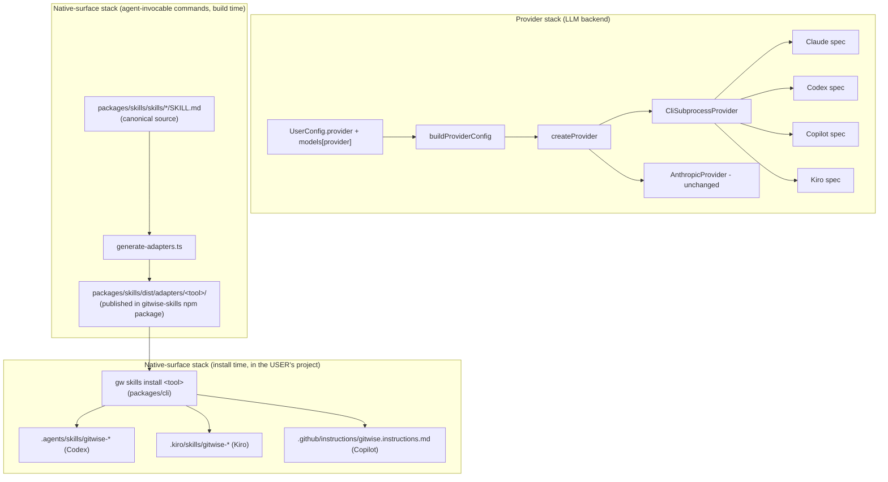

# Codex/Kiro/Copilot Support Design

**Spec**: `.specs/features/codex-kiro-copilot-support/spec.md`
**Status**: Draft

---

## Architecture Overview

Two independent stacks, tied together only by config:

1. **Provider stack** (`packages/core/src/providers/*`) — a shared `CliSubprocessProvider` base handles spawn/timeout/error-wrapping once; Claude, Codex, Copilot, and Kiro each become a thin `CliProviderSpec` (binary resolution + arg-building + output-parsing). `createProvider()` stays the single factory entry point.
2. **Native-surface stack** — a build-time generator inside `packages/skills` reads the canonical `packages/skills/skills/*/SKILL.md` + compiled scripts and emits Codex's, Kiro's, and Copilot's adapter variants into `packages/skills/dist/adapters/<tool>/`, published as part of the `@denisvieiradev/gitwise-skills` npm package. A new `gw skills install <tool>` CLI command (in `packages/cli`, which gains a runtime dependency on `@denisvieiradev/gitwise-skills`) copies those bundled files into whatever project the user runs it in. This replaces the originally-planned "commit generated files at gitwise's own repo root" approach — investigation found the existing `.gemini/skills/*` precedent used that approach and never reached an actual end user's project; `.gemini/*` is removed, not extended.

Independent of which provider a user has configured — you can drive `gw commit` with Kiro as the LLM backend while sitting inside a Codex session that was set up via `gw skills install codex`, or any other combination. Config is the seam between "which tool am I typing into" (native surface, installed once via `gw skills install`, no config needed afterward — each tool just discovers its own files) and "which tool answers the LLM calls" (`provider` setting, resolved through `ModelsByProvider` + the new `gw provider` picker).



---

## Code Reuse Analysis

### Existing Components to Leverage

| Component | Location | How to Use |
|---|---|---|
| `ClaudeCodeProvider` spawn/timeout/error logic | `packages/core/src/providers/claude-code.ts` | Generalize into `CliSubprocessProvider`; Claude becomes the first `CliProviderSpec` consumer, proving the extraction is behavior-preserving before Codex/Copilot/Kiro are added. |
| `resolveClaudeBinary` candidate-path pattern | `packages/core/src/providers/claude-code.ts:39-71` | Same shape (explicit path → common install dirs → `PATH` → nvm) reused for `resolveCodexBinary`, `resolveCopilotBinary`, `resolveKiroBinary`. |
| `runFirstRun` detection + `@clack/prompts` picker | `packages/cli/src/first-run.ts` | Refactored into a shared `detectAvailableProviders()` used by both the first-run wizard and the new `gw provider` command, so the two never drift. |
| `gw config <key> <value>` dot-path get/set | `packages/cli/src/commands/config.ts` | `VALID_KEYS` grows to cover the new CLI-path keys and `models.<provider>.<tier>`; provider-value validation added where none exists today. |
| `.gemini/skills/gitwise-*` hand-adaptation technique (file removed, technique kept) | `.gemini/skills/*/SKILL.md` (deleted by GEM-01) | The *technique* (workspace-relative script path instead of `${CLAUDE_PLUGIN_ROOT}`) is reused by the generator's Codex/Kiro output; the *files* are removed, not left in place, since they never reached an end user's project (AD-003). |
| `packages/skills/scripts/*.ts` thin command wrappers | `packages/skills/scripts/{commit,review,pr,release}.ts` | Unchanged — every native surface (Claude plugin, Codex, Kiro, Copilot) ultimately shells out to these same four scripts. |
| Existing `MergedConfig`/`deepMerge` config pipeline | `packages/core/src/config/{types,merge,user}.ts` | Extended, not replaced — `ProviderKind` and `ModelsByProvider` slot into the same read → merge → consume flow. |

### Integration Points

| System | Integration Method |
|---|---|
| 8 existing `createProvider({ kind: config.provider, models: config.models, ... })` call sites (4 in `packages/cli/src/commands/*`, 4 in `packages/skills/scripts/*`) | Replaced with a single `buildProviderConfig(merged, apiKey?)` helper exported from `packages/core`, so the per-provider `models[provider]` lookup and the new `*CliPath` fields are resolved in exactly one place. |
| `packages/skills` build (`tsup`) | Gains a `postbuild`-style step running `generate-adapters.ts` against the already-built `dist/scripts/*` and the source `skills/*/SKILL.md`, writing into `packages/skills/dist/adapters/<tool>/`. |
| `packages/skills` npm package `files` | Gains `dist/adapters` (already covered by the existing `"dist"` entry, since adapters live under `dist/`) so the generated templates ship to npm. |
| `packages/cli` dependency graph | Gains `@denisvieiradev/gitwise-skills` as a new runtime dependency, used only by the new `gw skills install` command to read bundled adapter templates. |
| `.gitwise/release-plan.json` persistence (`release-plan.ts`) | Schema gains `tokensAvailable` alongside `tokens`; the validator (`release-plan.ts:99`) treats a missing field in an already-persisted plan as `true`. |
| `.gemini/settings.json`, `.gemini/skills/` | Removed via `git rm` (GEM-01) — dead weight identified during this feature's design, never a working distribution path. |

---

## Components

### `CliSubprocessProvider`

- **Purpose**: One implementation of "spawn a CLI non-interactively, feed it a prompt, capture stdout/stderr, wrap failures" shared by every CLI-backed provider.
- **Location**: `packages/core/src/providers/cli-subprocess.ts`
- **Interfaces**:
  - `constructor(spec: CliProviderSpec, models: ModelConfig)`
  - `chat(req: LLMChatRequest): Promise<LLMChatResponse>` — implements `LLMProvider`
- **Dependencies**: `node:child_process` (`spawn`), `GitwiseError`, `debug` logger.
- **Reuses**: Extracted, generalized from `ClaudeCodeProvider`'s `spawnClaude`/`callViaCli`/`callViaStdin`/`wrapError`/`LARGE_PROMPT_THRESHOLD` logic — behavior-preserving for the Claude path, parameterized for the other three.

### `CliProviderSpec` (data, not a class)

- **Purpose**: The only thing that differs between Claude/Codex/Copilot/Kiro — binary resolution, argv shape, and output parsing — captured as plain data so adding a 5th tool never touches `CliSubprocessProvider` itself.
- **Location**: `packages/core/src/providers/{claude-code,codex,copilot,kiro}.ts` (one spec object per file, each exporting a `resolveXBinary()` matching the existing naming convention).
- **Interfaces**:
  - `resolveBinary(customPath?: string): string | null`
  - `buildArgs(input: { combinedPrompt: string; modelId: string; large: boolean }): string[]`
  - `parseOutput(stdout: string): { content: string; tokens: { input: number; output: number } | null }` — `null` tokens means "not reported," translated to `tokensAvailable: false` by `CliSubprocessProvider`.
  - `installHint: string` — used in the `PROVIDER_UNAVAILABLE` error message.
- **Dependencies**: none beyond `node:fs`/`node:os`/`node:path` for binary resolution (mirrors `claude-code.ts` today).
- **Reuses**: `claude-code.ts`'s exact candidate-path/PATH/nvm resolution shape, applied to each tool's own known install locations.

### `buildProviderConfig`

- **Purpose**: The single place that turns a `MergedConfig` (+ optional API key) into the `ProviderConfig` object `createProvider()` expects — replacing 8 duplicated inline object literals.
- **Location**: `packages/core/src/providers/factory.ts` (co-located with `createProvider`)
- **Interfaces**:
  - `buildProviderConfig(merged: MergedConfig, apiKey?: string): ProviderConfig`
- **Dependencies**: `MergedConfig`, `ProviderConfig` types.
- **Reuses**: Replaces the inline `{ kind: config.provider, models: config.models, apiKey, claudeCliPath: config.claudeCliPath }` pattern currently duplicated in `packages/cli/src/commands/{commit,review,pr,release}.ts` and `packages/skills/scripts/{commit,review,pr,release}.ts`.

### `detectAvailableProviders`

- **Purpose**: Shared detection logic ("which of Claude/Codex/Copilot/Kiro's CLIs are actually installed") used by both the first-run wizard and the new `gw provider` command, so they can never disagree.
- **Location**: `packages/cli/src/detect-providers.ts`
- **Interfaces**:
  - `detectAvailableProviders(): DetectedProvider[]` where `DetectedProvider = { kind: ProviderKind; label: string; binaryPath: string | null }`
- **Dependencies**: Each provider spec's `resolveXBinary()`.
- **Reuses**: The five `resolveXBinary()` functions from the provider stack.

### `gw provider` command

- **Purpose**: Interactive provider picker — the friendly path for "allow change easily."
- **Location**: `packages/cli/src/commands/provider.ts`
- **Interfaces**: `makeProviderCommand(): Command` (Commander), following the exact shape of `makeConfigCommand()`.
- **Dependencies**: `detectAvailableProviders`, `@clack/prompts`, `writeUserConfig`.
- **Reuses**: `runFirstRun`'s `@clack/prompts` interaction pattern; writes config the same way.

### `generate-adapters` (build-time generator)

- **Purpose**: Produce Codex/Kiro/Copilot adapter *templates* from the canonical `packages/skills/skills/*/SKILL.md` so they cannot drift out of sync with the Claude plugin's own commands. Output is a template to be installed later, not a final in-repo file — it targets a package-relative script path (resolved at install time), not a path relative to gitwise's own repo.
- **Location**: `packages/skills/scripts/generate-adapters.ts`
- **Interfaces**: No exported API — a build-time script invoked via `packages/skills`'s `build` npm script after `tsup` compiles. Writes to `packages/skills/dist/adapters/{codex,kiro,copilot}/...`.
- **Dependencies**: `node:fs`, the source `skills/*/SKILL.md` files, gray-matter-style frontmatter parsing (reuse whatever the existing `marketplace.test.ts`/`skills.test.ts` already parse frontmatter with, if anything — otherwise a minimal hand-rolled frontmatter split, since the format is just `---\n...\n---\n`).
- **Reuses**: The workspace-relative-script-path *technique* that `.gemini/skills/*` demonstrated, adapted for a package-relative (not repo-relative) path, since the output is now installed into arbitrary user projects rather than committed at a fixed location in gitwise's own repo.

### `gw skills install <tool>` command

- **Purpose**: The real distribution step — copies a tool's generated adapter files from the bundled `@denisvieiradev/gitwise-skills` package into whatever project the user runs the command in. This is both the install path and the update path (re-running it overwrites gitwise-managed files with the currently-bundled version).
- **Location**: `packages/cli/src/commands/skills.ts`
- **Interfaces**: `makeSkillsCommand(): Command` (Commander) — `gw skills install <tool>`, `<tool>` ∈ `{codex, kiro, copilot}`.
- **Dependencies**: `@denisvieiradev/gitwise-skills` (new `packages/cli` runtime dependency, read for its bundled `dist/adapters/<tool>/` templates), `node:fs` for copying into `process.cwd()`.
- **Reuses**: Nothing pre-existing — this is genuinely new surface area, since no prior gitwise feature ever installed files into a user's own project (the Claude plugin's install path is Claude Code's own marketplace mechanism, not gitwise's code).

---

## Data Models

### `ProviderKind` (centralized, not duplicated)

```typescript
// packages/core/src/providers/types.ts
export type ProviderKind = "api" | "claude-code" | "codex" | "copilot" | "kiro";
```

Imported by `config/types.ts` (`import type { ProviderKind } from "../providers/types.js"`) rather than redefined — avoids repeating the pre-existing, unrelated `ModelTier` duplication between those two files (flagged below in Risks & Concerns, not fixed here).

### `ModelsByProvider`

```typescript
// packages/core/src/config/types.ts
export type ModelsByProvider = Record<ProviderKind, ModelConfig>;

export interface UserConfig {
  provider: ProviderKind;
  claudeCliPath?: string;
  codexCliPath?: string;
  copilotCliPath?: string;
  kiroCliPath?: string;
  models: ModelsByProvider;       // was: ModelConfig
  language: Language;
  defaultBaseBranch?: string;
  commitConvention: CommitConvention;
}

export interface RepoConfig {
  models?: Partial<ModelConfig>;  // unchanged shape — applies only to the active provider (see merge below)
  // ...unchanged fields
}
```

`MergedConfig` still extends `UserConfig`, so `MergedConfig.models` remains the full `ModelsByProvider` map — `buildProviderConfig` is what narrows it to the one active provider's `ModelConfig` when constructing a `ProviderConfig`.

**Relationships**: `DEFAULT_USER_CONFIG.models` becomes an object with all five `ProviderKind` keys, each holding that vendor's current documented default model names (Claude's two entries keep today's values; Codex/Copilot/Kiro's defaults are pinned during Execute against each vendor's current model catalog, per the spec's logged assumption).

### `CliProviderSpec`

```typescript
// packages/core/src/providers/types.ts
export interface CliProviderSpec {
  toolName: string;
  installHint: string;
  resolveBinary(customPath?: string): string | null;
  buildArgs(input: { combinedPrompt: string; modelId: string; large: boolean }): string[];
  parseOutput(stdout: string): { content: string; tokens: { input: number; output: number } | null };
}
```

### `LLMChatResponse` (extended)

```typescript
// packages/core/src/providers/types.ts
export interface LLMChatResponse {
  content: string;
  tokens: { input: number; output: number };
  tokensAvailable: boolean;   // NEW — false when the provider doesn't report usage (AD-002)
}
```

**Relationships**: Every command's returned type that currently carries `tokens: { input: number; output: number }` (`CommitPlan`, `ReviewResult`, `PrDraft`, `ReleasePlan` in `packages/core/src/commands/*.ts`) gains the same `tokensAvailable: boolean` field, populated from the underlying `LLMChatResponse`. `release.ts`'s multi-call aggregation (`totalInput += ...` across up to three calls in one release run) ANDs `tokensAvailable` across all calls it aggregates — in practice always uniform within one run, since a run uses exactly one provider.

---

## Error Handling Strategy

| Error Scenario | Handling | User Impact |
|---|---|---|
| Configured provider's CLI binary not found | `CliSubprocessProvider` raises `GitwiseError { code: "PROVIDER_UNAVAILABLE" }` naming the tool | Error message tells the user to re-run `gw provider`, mirroring today's Claude Code message. |
| CLI process exits non-zero (any of the 4 CLI providers) | Underlying stderr/error text surfaced verbatim, unmodified | User sees the vendor's own error (auth failure, rate limit, subscription gate, etc.) without gitwise guessing at the cause. |
| `gw config provider <invalid-value>` | Rejected before any write, error lists valid values | No corrupted config state; existing valid config untouched. |
| Legacy flat `models` config, `provider` value itself invalid | Migration backfills all five provider keys from defaults rather than guessing which key the flat block belonged to (see spec Edge Cases) | Silent, safe upgrade; no crash on a corrupted/hand-edited config file. |
| Old persisted `.gitwise/release-plan.json` missing `tokensAvailable` | Validator (`release-plan.ts:99`) defaults missing field to `true` | An in-flight `prepare`/`finish` cycle started before this upgrade still `finish`es correctly. |
| `.github/instructions/`, `.agents/skills/`, or `.kiro/skills/` doesn't exist yet in the target project | `gw skills install <tool>` creates the directory | No failure on first install in a fresh project. |
| `gw skills install <tool>` with an unrecognized `<tool>` | Rejected before any file write, error lists `{codex, kiro, copilot}` | No partial/garbage install directory created. |
| `gw skills install <tool>` run somewhere unwritable (no permission, read-only filesystem) | Fails fast on the first write attempt with the underlying filesystem error surfaced, before any subsequent files are written | User sees a clear I/O error rather than a silently half-installed skill. |

---

## Risks & Concerns

| Concern | Location (file:line) | Impact | Mitigation |
|---|---|---|---|
| Thin existing test coverage for the class being refactored into a shared base | `packages/core/__tests__/unit/providers/claude-code.test.ts` (61 lines, 2 tests) for `claude-code.ts` (~230 lines, several branches) | Extracting `CliSubprocessProvider` without more coverage risks silently changing Claude's behavior (large-prompt stdin threshold, ENOENT wrapping, non-JSON-stderr filtering) | Add characterization tests covering every existing branch *before* the extraction (first task of the provider-refactor phase), so the refactor can be verified against them rather than against the current thin suite. |
| `config/merge.ts:16-19` current flat-spread merge (`models: { ...base.models, ...(override.models ?? {}) }`) | `packages/core/src/config/merge.ts:16-19` | Left unchanged, it would silently corrupt the per-provider map by injecting `override.models`'s flat tier keys as if they were provider names | Rewritten as part of this feature to merge `override.models` into `base.models[base.provider]` only — this is not optional cleanup, it is required correctness for MDL-06. |
| Token-usage plumbing has wider blast radius than the spec's user-facing wording implies | `packages/core/src/commands/{commit,review,pr,release,release-plan}.ts`, `packages/cli/src/commands/{commit,review,pr,release}.ts` | Underestimating this during Tasks would produce an incomplete implementation (e.g. CLI print sites updated but `release-plan.json` schema/validator missed) | Captured explicitly as its own task-phase (see Tasks); AD-002 records the `tokensAvailable` convention project-wide. |
| Pre-existing `ModelTier` duplication between `config/types.ts` and `providers/types.ts` | `packages/core/src/config/types.ts:3`, `packages/core/src/providers/types.ts:1` | Unrelated pre-existing debt; not this feature's to fix | Not fixed here (out of scope) — but the new `ProviderKind` type is defined once and imported, so this feature doesn't add a second instance of the same mistake. |
| Kiro cannot be exercised against a live paid account during this work | N/A (external constraint) | Kiro's provider/skill support ships verified only against documented CLI contract + mocked subprocess I/O | Already logged in spec Assumptions; carried into Tasks as explicit test-approach guidance for the Kiro-specific tasks. |
| Exact CLI argv shape (stdin-vs-argv for large prompts, JSON usage-field presence) for Codex/Copilot/Kiro not fully confirmed by documentation alone | `packages/core/src/providers/{codex,copilot,kiro}.ts` (new files) | Building against an incorrect assumption about flag names or output shape would produce a provider that silently fails against the real CLI | Each new provider's implementation task starts with a Knowledge-Verification-Chain check against the real installed CLI's `--help` output (or its docs, if the CLI isn't installed in the dev environment) before writing `buildArgs`/`parseOutput`, per the spec's logged assumption. |
| `gw skills install <tool>` writes into a directory (`.agents/skills/`, `.kiro/skills/`, `.github/instructions/`) it doesn't fully own — a user may have unrelated skills/instructions already there | Any consuming project's own `.agents/skills/`, `.kiro/skills/`, `.github/instructions/` | An overly broad write (e.g. clearing the whole directory before writing) would destroy a user's own unrelated files — a real destructive-action risk, not just a correctness nicety | Scoped strictly to `gitwise-*`-named paths / the single `gitwise.instructions.md` file (spec DIST-04); never a directory-clearing write. Covered by a task-level test that seeds an unrelated file in the target directory first and asserts it survives install. |
| `.gemini/settings.json` / `.gemini/skills/` removal is a real `git rm` of tracked files, not an untracked cleanup | `.gemini/*` | Removing tracked files is visible in `git log`/`git blame` and, if done carelessly alongside unrelated changes, muddies the commit history | Its own atomic commit (GEM-01/02), scoped to nothing but the removal — no other changes bundled into that commit. |

---

## Tech Decisions (only non-obvious ones)

| Decision | Choice | Rationale |
|---|---|---|
| Provider implementation strategy | Shared `CliSubprocessProvider` base + per-tool `CliProviderSpec`, refactoring `ClaudeCodeProvider` onto it | User-confirmed (see conversation); avoids ~700 lines of near-duplicate spawn/error-handling code across 4 files — see AD-001. |
| Native-surface production | Build-time generator over hand-writing 3 more tool-specific copies | User-confirmed; existing `.gemini/skills/*` hand-copies already drifted from the canonical wording — see AD-003. |
| Native-surface delivery mechanism | Runtime `gw skills install <tool>` command copying bundled npm-package templates into the user's own project, over committing generated files at gitwise's own repo root | User-confirmed after discovering `.gemini/skills/*` never reached an end user's project (repo-root-only, never published, no install path) — see AD-003. `.gemini/*` is removed rather than kept as a second pattern alongside the new one. |
| `gw skills install` update behavior | Re-running the same install command overwrites gitwise-managed files with the currently-bundled version; no separate `update` subcommand or version diff | Matches gitwise's existing "no persistent state, re-run to refresh" philosophy; avoids inventing new state (an installed-version marker) for MVP. |
| Missing token-usage representation | `tokensAvailable: boolean` field, not a sentinel value | `0/0` would misleadingly imply a free call; a sentinel (`-1`) is fragile and easy to forget to check — see AD-002. |
| `models` config migration timing | Inside `readUserConfig`, persisted immediately as a side effect of the first read after upgrade | Matches spec MDL-05's "one-time, transparent upgrade, no user action required" — a read-only `gw config <key>` invocation still triggers and completes the one-time migration. |
| `RepoConfig.models` override scope | Applies only to `base.models[base.provider]`, never to every provider's block | Matches spec MDL-06; a single repo is normally driven by one active provider at a time. |
| Copilot/Kiro exact argv flags and output shape | Not hard-coded from documentation alone; verified against the real CLI (or its current docs) at the start of each provider's implementation task | Per the Knowledge Verification Chain — documentation for all three tools left real gaps (no confirmed system-prompt flag, no confirmed token-usage field for Codex), so treating today's research as final would risk building against an invented API. |
